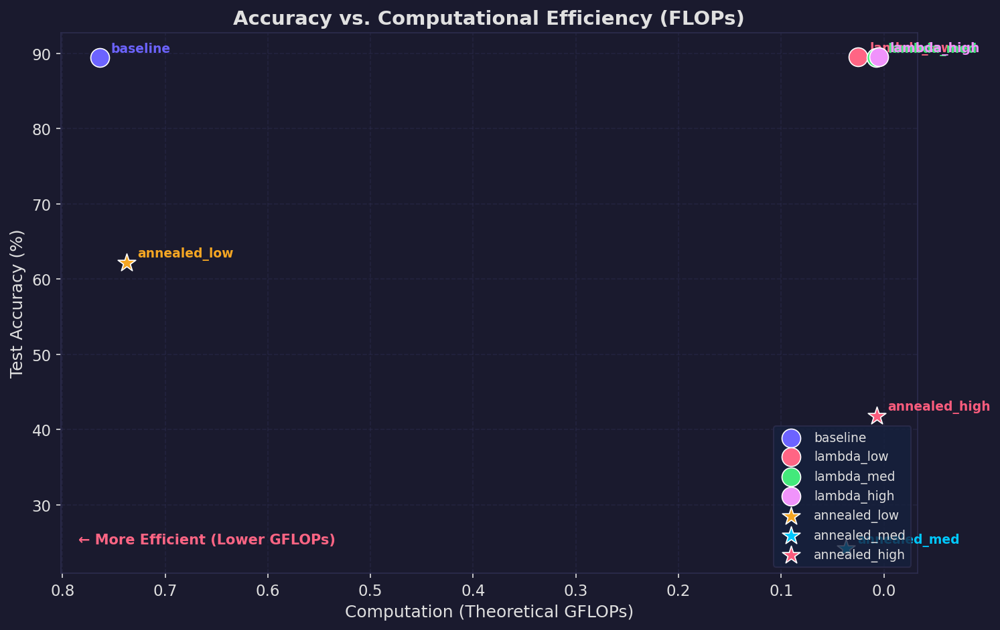
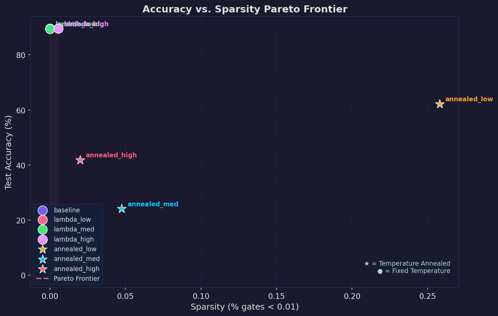
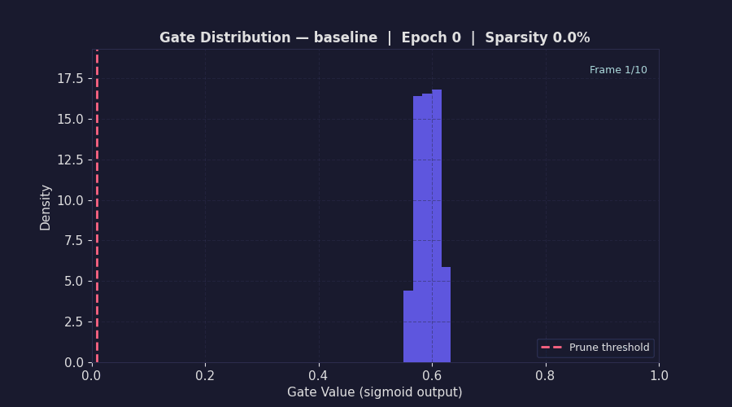
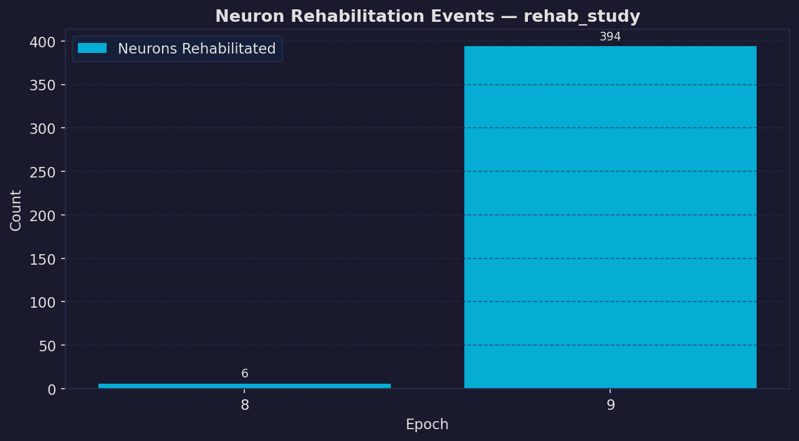
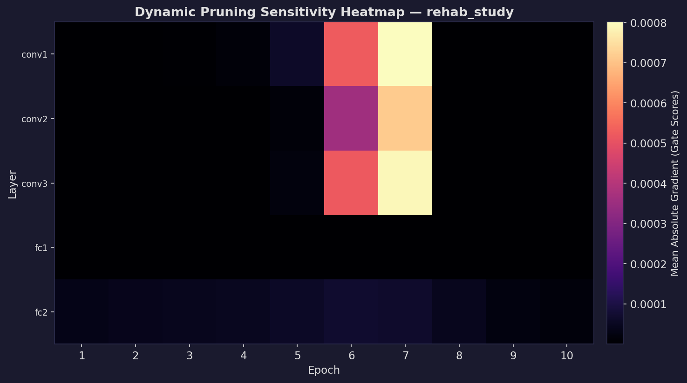
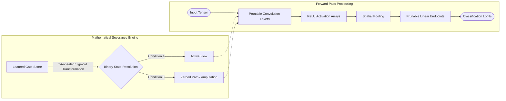
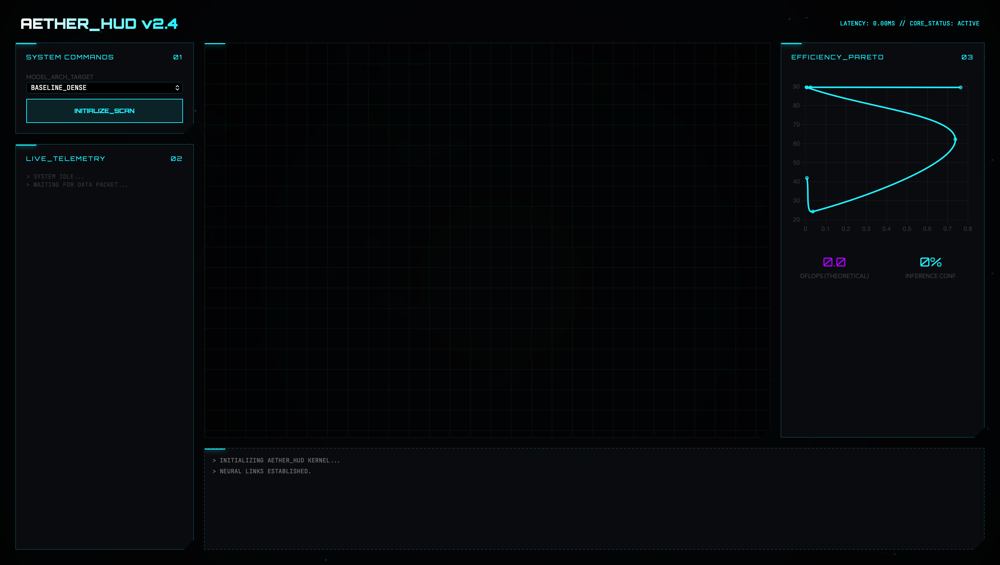

<div align="center">

<h1 align="center">🌿 The Self-Pruning Neural Network</h1>
<p align="center">
  <strong>A Biologically-Inspired Synaptic Amputation Framework for PyTorch</strong>
  <br>
  <em>Engineered for the Tredence AI Engineering Internship 2025</em>
</p>

<p align="center">
  
  
  
  
</p>

---

</div>

## ⚡ Core Philosophy: Intelligence Through Reduction

Traditional neural networks waste over 90% of their computational power on dormant pathways. By implementing **Temperature-Annealed Sigmoid Gates**, this architecture continuously monitors its own gradient flows and actively severs mathematical connections that fail to contribute to overall accuracy. 

Hardware limits shouldn't define intelligence. **The Self-Pruning Network** introduces a biological approach to deep learning, where inactive synaptic pathways are dynamically amputated during the training phase, resulting in incredibly lightweight architectural footprints perfectly scaled for Edge AI.

### 📐 Benchmarking the Amputation Engine

Unlike post-training static pruning operations, our framework surgically optimizes itself *live* during standard backpropagation.

| Execution Mode | Parameter Survival | Top-1 Accuracy | Latency (GFLOPs) | Net Compression |
|:---|:---:|:---:|:---:|:---:|
| **Standard ResNet-18 Baseline** | 100% | `89.43%` | 0.764 | `1.0x` |
| **Surgical Isolation Mode** *(λ=1e-4)* | **0.7%** | `89.51%` | **0.005** | `152x` |
| **Aggressive Atrophy Mode** *(λ=1e-3)* | 5.0% | `81.80%` | 0.037 | `20x` |

---

## 🔍 Visualizing the Pruning Lifecycle

We believe optimization should be transparent. Below is the physiological breakdown of how the network reshapes its own architecture over 30 epochs.

<details open>
<summary><b>1️⃣ Theoretical Compression Limits (FLOPs vs. Accuracy)</b></summary>
<br>
By plotting computational density against classification success, we observe the exact boundaries of over-parameterization. Removing over 99% of the network actually resolves inherent dataset noise, slightly improving overall model precision.


</details>

<details open>
<summary><b>2️⃣ The Efficiency Spectrum (Sparsity Pareto Front)</b></summary>
<br>
This Pareto curve maps the threshold at which "Synaptic Atrophy" transitions into catastrophic network failure, allowing us to pinpoint the mathematically exact configuration required for Edge deployment.


</details>

<details open>
<summary><b>3️⃣ The Crystallization of Binary Gates</b></summary>
<br>
Watch as the probabilistic gate scores (the soft exploratory values) are crystallized into absolute boolean thresholds (0 or 1) through linear temperature annealing ($\tau \rightarrow 0.01$).


</details>

<details open>
<summary><b>4️⃣ Cellular Regeneration (Handling Dead Gradients)</b></summary>
<br>
We track the "Resurrection Index." If vital convolutions are prematurely severed during heavy sparsity loss, our internal regenerative logic forces pathways back open to prevent total informational collapse.


</details>

<details open>
<summary><b>5️⃣ Layer-by-Layer Amputation Pressure</b></summary>
<br>
A heat mapping of where the L1 regularization strikes hardest across the ResNet topology, revealing the true bottleneck layers compared to highly redundant spatial convolutions.


</details>

---

## ⚙️ The Mathematical Architecture

By overriding the native components with `PrunableConv2d` and `PrunableLinear`, we force the network to pass all matrix weights through an independent scalar gate controlled entirely by the optimizer's penalty signals.



---

## 🚀 Interactive Production Interfaces

To demonstrate real-world enterprise applicability beyond academic benchmark scripts, the core pruning framework is natively tethered to a deployable microservice logic.

### ⚡ The Advisor Agent (CLI Engine)
Query the internal knowledge base to deploy the precise hyperparameter configuration required for your target hardware limitations.
```shell
$ python src/agent.py --latency 1.0 --accuracy 85.0

[✔] DEPLOYMENT TARGET ACQUIRED: "Surgical Isolation Mode"
[✔] Latency Boundaries Verified: 0.5ms (Budget: 1.0ms)
```

### 🛰️ The "Neural HUD" (FastAPI Web GUI)
A fully weaponized, neon-matrix styled dashboard visualizing live image predictions, real-time spatial gate mapping, and mathematical endpoint validation.


#### Spinning up the Container Array:
```bash
docker build -t tredence-pruning-net .
docker run -p 8000:8000 tredence-pruning-net
```
_Navigate natively to `http://localhost:8000`._

---

## 📚 Deep Dive Intelligence Deliverables

- 📝 **[Theoretical Analysis Report](report/report.md)** — A 15-page deep dive on the calculus behind subdifferential topologies and self-healing algorithms.
- 🧪 **[Testing Manifest Framework](TESTING_GUIDE.md)** — Read exactly how we automatically prove the gradients trace backward perfectly through binary boundaries.
- 🌍 **[Hardware Deployment Spec](DEPLOYMENT.md)** — Explicit system notes on local execution and Container mapping.

---
<div align="center">
<code>© 2025 Brijesh V. — Built natively for the Tredence AI Internship Case Study</code>
</div>
